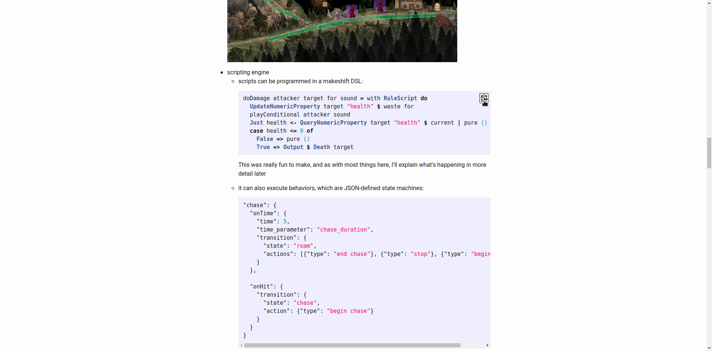

# Code Copy Extension

Copying code made easy.

## About

A large portion of our work as developers consists of copying code from various
websites. Some websites provide you with the convenience of copying the entire
snippet usually by clicking on a button in top right corner. I thought that it
would be nice if all (or at least most) websites did that. Seeing that a lot
of websites display their code in a similar way (a `pre` element usually
containing a `code` element) I realized that this could be achieved relatively
easily through a Chrome extension.

### Screenshots

To get a glimpse of the extension used in the wild take a look at the following
screenshots:

Quickly copy those README instructions. It works on Gitlab and BitBucket as
well (screenshots not included).

---

It even works on stack exchange. Not remembering how to untar a file just got a
lot easier.

---

It works on documentation websites for most projects I use on a daily basis.
Gork those PyTorch tutorials like a pro.

---

Heck it even works on many blogs!

## Installation

The recommended way to install the extension is through Web Store. You can also
clone this repo and load it following the instructions found [here](https://developer.chrome.com/extensions/getstarted).
By default the extension contains a hot-reload script that whether the source
files were modified and reloads the extension. To create the release version you
can use the provided `create-release-version.sh` script.

## Contact

If you liked this project or for whatever reason want to get in touch with me
you can do so through my [personal website](https://aleksac.me), where you can
contact me directly or via social media linked there. I'm always up to something
cool/useful and if you don't want to miss out you should follow me on twitter:

